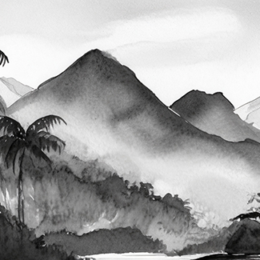

README.MD

# CSS Inline Sizes

The CSS inline sizes is a CSS technique used to avoid the content [reflow issue](https://www.google.com/search?q=content+reflow+issue) on images displayed on your web pages. The page load is smoother because the image sizes are considered part of the [inline critical css](https://www.google.com/search?q=inline+critical+css). I’d say it is pretty robust. 

You may use this method in: 

- Static images to display a regular image
- Responsive images that adapt to the container
- Art directed images to display a completely different images per media query rule.  
- Images with multiple resolutions, 2x and such
- Any mix of the options above

## Demo

The [full documentation](https://pages.github.com/) for the demo can be seen here. To use the demo: 

- Lower your bandwidth using the inspector tool on your browser and reload the page. 
- Use the responsive design mode to resize the screen as the page loads. 

Links: 
- [Demo with regular page load](https://alberto-torres.github.io/css-inline-sizes/images.html)
- [Demo with lazyload via lazysizes](https://alberto-torres.github.io/css-inline-sizes/images-lazyload.html)

Do you see any fluctuation in the layout as the page loads? So far the answer has been: no

## How it works? 

In essence, to apply the css inline sizes fix add the different image sizes in the inline critical CSS. You may target images via an ID attribute.  Let me show you examples:

### Art Directed images

CSS

```css

/* IMG placeholder graphic */

.ixi-picture__placeholder {   
   background-color: #ffffd9; 
   background-position: left top;
   background-repeat: no-repeat; 
   background-size: 100% 100%;
   background-image: url("data:image/svg+xml;base64,PHN2ZyB4bWxucz0iaHR0cDovL3d3dy53My5vcmcvMjAwMC9zdmciIHZpZXdCb3g9IjAgMCAxNjMuMzkgMjM4LjI1Ij48ZGVmcz48c3R5bGU+LmF7ZmlsbDojZmZmO308L3N0eWxlPjwvZGVmcz48cGF0aCBjbGFzcz0iYSIgZD0iTTE1OSwyMzguMjUsMCwwSDguNjdMMTYzLjM5LDIzOC4yNVoiLz48L3N2Zz4=");
   display: inline-block;
}


/* Media queries for image sizes */


[data-id='img-1'] .ixi-picture__img {
	height: 325px;
	width: 325px 
}


@media only screen and (min-width: 700px) {

	[data-id='img-1'] .ixi-picture__img {
		height: 410px;
		width: 600px 
	}

}

@media only screen and (min-width: 1025px) {

	[data-id='img-1'] .ixi-picture__img {
		height: 700px;
		width: 1024px 
	}

}

```

HTML
```html

<figure class="ixi-picture" data-id="img-1">
			   	
   	<picture class="ixi-picture__picture ixi-picture__placeholder">

			<source media="(min-width: 1025px)" srcset="imgs/1-large-landscape.png, imgs/1-large-landscape@2x.png 2x">
		
			<source media="(min-width: 700px)" class="ixi-picture__medium" srcset="imgs/1-medium-landscape.png, imgs/1-medium-landscape@2x.png 2x">
		
			<source media="(max-width: 699px)" class="ixi-picture__small" srcset="imgs/1-small-square.png, imgs/1-small-square@2x.png 2x">
		
			

   	</picture>

</figure>

```

### Responsive images

CSS
```css

/* IMG placeholder graphic */

.ixi-picture__placeholder {   
   background-color: #ffffd9; 
   background-position: left top;
   background-repeat: no-repeat; 
   background-size: 100% 100%;
   background-image: url("data:image/svg+xml;base64,PHN2ZyB4bWxucz0iaHR0cDovL3d3dy53My5vcmcvMjAwMC9zdmciIHZpZXdCb3g9IjAgMCAxNjMuMzkgMjM4LjI1Ij48ZGVmcz48c3R5bGU+LmF7ZmlsbDojZmZmO308L3N0eWxlPjwvZGVmcz48cGF0aCBjbGFzcz0iYSIgZD0iTTE1OSwyMzguMjUsMCwwSDguNjdMMTYzLjM5LDIzOC4yNVoiLz48L3N2Zz4=");
   display: inline-block;
}


/* Media queries for image sizes 
 * Image 2 uses the aspect ratio fix
 * 
 */


/* Image sizes is 325x325 */

[data-id='img-2'] .ixi-picture__picture {
	padding-top: calc( (325 / 325) * 100%);
	position: relative;
}

	[data-id='img-2'] .ixi-picture__img {
		width: 325px;
		height: 100%;
		position: absolute;
		top: 0;
		left: 0;
	}


@media only screen and (min-width: 700px) {

	/* Image sizes is 600x410 */

	[data-id='img-2'] .ixi-picture__picture  {
		padding-top: calc(410 / 600 * 100%);
		width: 600px 
	}

}

@media only screen and (min-width: 1025px) {

	/* Image sizes is 1024x700 */

	[data-id='img-2'] .ixi-picture__picture {
		padding-top: calc(700 / 1024 * 100%);
		width: 1024px 
	}

}

```

HTML
```html

<div class="ixi-fluid">

	<figure class="ixi-picture ixi-picture--fluid" data-id="img-8">
			
			<picture class="ixi-picture__picture ixi-picture__placeholder">
			
				<source media="(min-width: 1025px)" srcset="imgs/8-large-landscape.png, imgs/8-large-landscape@2x.png 2x">
			
				<source media="(min-width: 700px)" class="ixi-picture__medium" srcset="imgs/8-medium-landscape.png, imgs/8-medium-landscape@2x.png 2x">
			
				<source media="(max-width: 699px)" class="ixi-picture__small" srcset="imgs/8-small-square.png, imgs/8-small-square@2x.png 2x">
			
				

		</picture>

	</figure>

</div>

```


To see a full explanation of the demo, please read the [full article](https://pages.github.com/). 

